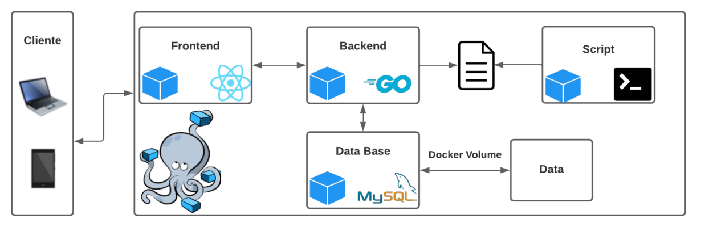
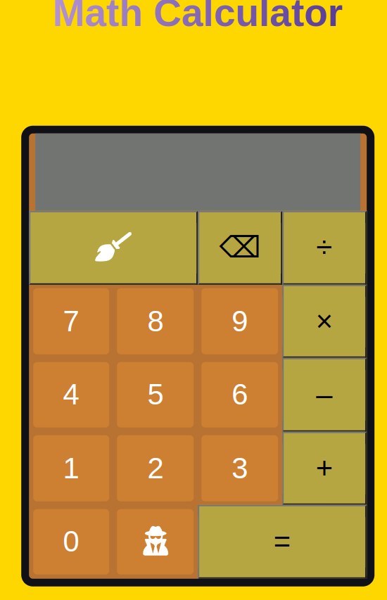
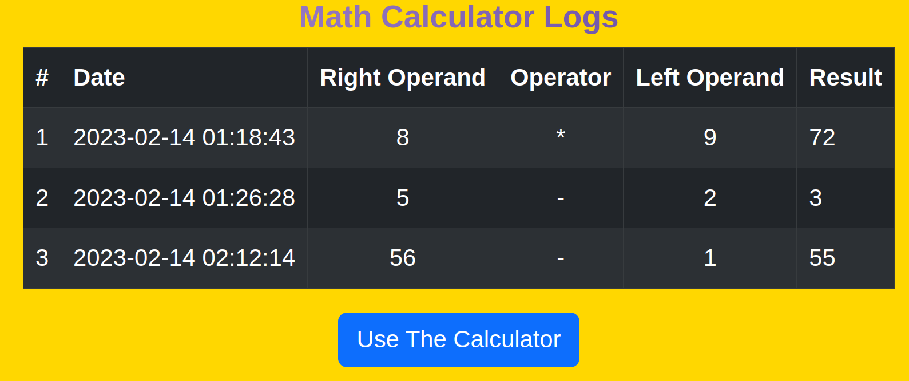
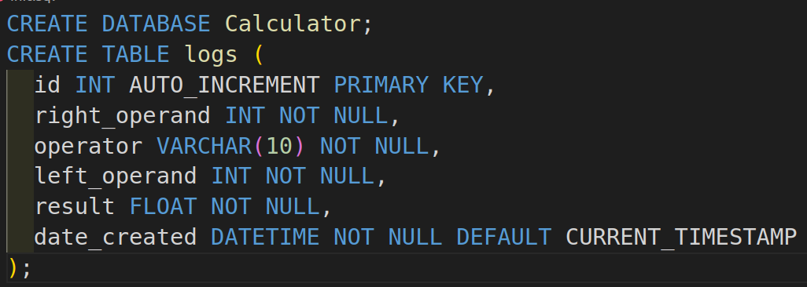
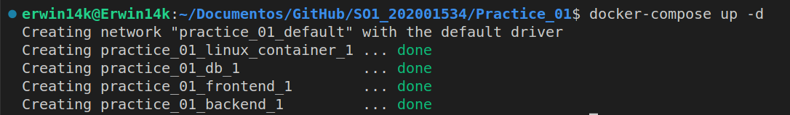
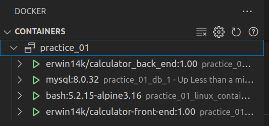
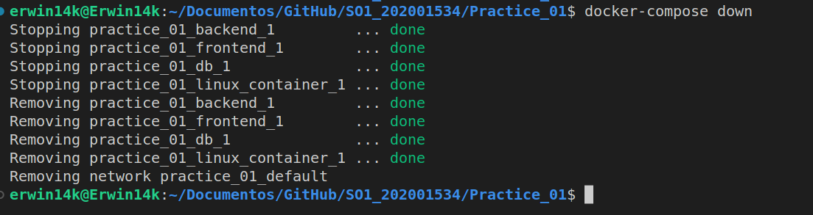

<html>
  <head>
    <meta charset="UTF-8">
  </head>
  <body>
    <h2>**Erwin Fernando Vásquez Peñate</h2>
    <h2>**202001534</h2>
    <h2>**Sistemas Operativos 01 Sección A</h2>
    <h1>Práctica 01</h1>
    <h2>Arquitectura</h2>
    

      La aplicación constará de la siguiente arquitectura:
    

    

      
    

    <h2>FrontEnd</h2>
    

      El frontend está desarrollado en react, la aplicación consta de una calculadora
      la cual puede usarse para resolver distintas operaciones matemáticas, todas
      las operaciones realizadas aquí serán enviadas al backend para ser operadas y 
      así poder obtener el resultado esperado.
    

    <h2>Calculadora</h2>
    

      La calculadora permite operaciones con números enteros, además de soportar
      operaciones con números negativos, las operaciones matemáticas disponibles son:
    

    <ul>
      <li>División</li>
      <li>Multiplicación</li>
      <li>Suma</li>
      <li>Resta</li>
    </ul>
    

      
    

    <h2>Tabla De Logs</h2>
    

      Esta tabla mostrará de manera detallada todas las operaciones a lo largo del
      tiempo, para llevar un historial de logs.
    

    

      
    

    <h2>Backend</h2>
    

      El backend está desarrollado en Golang, el cual se encarga de hacer la conexión
      a la base de datos para todas las consultas necesarias, además de levantar un
      servidor para atender las peticiones del frontend.
    

    <h2>Base De Datos</h2>
    

      La aplicación necesita poder llevar un historial de los logs a lo largo del tiempo
      por lo que es necesario una base de datos para poder llevar ese control de la 
      información, MySQL es la base de datos implementada para esta solución.
    

    <h2>Script SQL</h2>
    

      
    

    <h2>Docker</h2>
    

      La parte de docker es fundamental a la hora de poder construir una aplicación, ya
      que mediante los contenedores e imágenes que nos ofrece docker podemos utilizar 
      aplicaciones sin necesidad de instalarlas como tal, ahorrándonos mucho tiempo
      y también recursos en nuestro ordenador, para esta aplicación se generaron 2 
      imágenes, una para el frontend y otra para el backend, los enlaces de las 
      mismas se encuentran a continuación:
    

    <ul>
      <li>Backend: <a>https://hub.docker.com/repository/docker/erwin14k/calculator_back_end/general</a></li>
      <li>Frontend: <a>https://hub.docker.com/repository/docker/erwin14k/calculator-front-end/general</a></li>
    </ul>
    

      Además se utilizó una imágen para la base de datos, se utilizó la oficial
      de MySQL en su versión 8.0.32, la documentación oficial se encuentrá a continuación:
    

    <ul>
      <li><a>https://hub.docker.com/_/mysql</a></li>
    </ul>
    

      Para la base de datos se creó adicionalmente un volumen, el cuál almacenará
      toda la información, incluso si el contenedor está detenido.
    

    <h2>Docker-Compose</h2>
    

      Docker-Compose nos permite de manera rápida y eficiente poder darle vida
      a múltiples contenedores con un solo script, de manera que no haría falta
      irlos levantando uno por uno, el archivo para ejecutar el docker-compose, 
      debe ser con extensión ".yaml", los comandos tanto para iniciar un
      docker-compose como para terminarlo se muestran a continuacióne:
    

    <ul>
      <li>Levantar Contenedores: docker-compose up -d</li>
      

        
      

      

        
      

      <li>Detener Contenedores: docker-compose down</li>
      

        
      

    </ul>
    
  </body>
</html>
