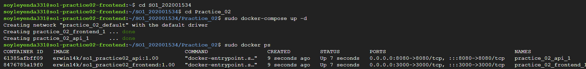

<html>
  <head>
    <meta charset="UTF-8">
  </head>
  <body>
    <h2>Erwin Fernando Vásquez Peñate</h2>
    <h2>202001534</h2>
    <h2>Sistemas Operativos 1</h2>
     
     
    <h1 style="text-align:center;">Práctica 02</h1>
    <h2>Tecnologías Utilizadas</h2>
    <ul>
      <li>Base De Datos: Mysql (Cloud SQL), Versión 8.0</li>
      <li>API: Node.Js Con Express</li>
      <li>Frontend: React js</li>
      <li>Backend: Golang Versión 1.19</li>
      <li>Contenedores: Para los contenedores de cada servicio, se utilizo Docker</li>
      <li>Módulos Linux: Programados en lenguaje "C"</li>
    </ul>
     
    <h2 style="text-align:center;">Arquitectura </h2>
    
La aplicación consta de la siguiente arquitectura:

    

      
    

     
    <h2 style="text-align:center;">Base de datos</h2>
    
Es muy importante que la información valiosa siempre se encuentre protegida y segura, por lo que no es una buena práctica dejar a simple vista las credenciales necesarias para acceder a una base de datos.

     
    
Para preservar la información y credenciales de manera segura, se recomienda usar archivos de entorno, los cuales se excluyen del repositorio o espacios de trabajo, para mantener todo de manera segura, para efectos de esta práctica, todo se dejó de manera explícita en el código, pero en una aplicación a gran escala no es recomendable.  

     
    
La base de datos, consta de 2 tablas, una llamada "resource", la cual por cada registro almacena el porcentaje de ram utilizado, el porcentaje de cpu utilizado y la fecha, la segunda tabla es llamada "process", la cual por cada registro almacena todas las características de cada proceso recolectado, como pueden ser (PID, nombre, usuario, porcentaje de ram utilizado), además también deja indicado el padre de cada proceso, en caso lo tuviera.

     
    
Las definiciones de las tablas:

     
    

      
    

     
    

      
    

     
    
Por si quieres ver el script de la base de datos detalladamente, puedes hacerlo accediendo al siguiente enlace:

    <ul>
      <li><a href="https://github.com/Erwin14k/SO1_202001534/blob/main/Practice_02/db/script.sql">Script SQL</a></li>
    </ul>
     
    
Para crear una instancia en cloudSQL, puedes seguir los siguientes pasos:

    <ul>
        <li>Acceder a Google Cloud</li>
        

            
        

        <li>Dirigirse a la opción SQL</li>
        

            
        

        <li>Crear una nueva instancia</li>
        

            
        

        <li>Seleccionar el motor de la base de datos deseado, En mi caso Mysql</li>
        

            
        

        <li>Configurar nuestra base de datos, llenar todos los campos de manera correcta</li>
        

            
        

        <li>Una vez configurada nuestra base de datos, creamos la instancia</li>
        

            
        

        <li>Despues de crearse, ya aparecerá en el listado de nuestras instancias, accedemos a ella</li>
        

            
        

    </ul>
     
    
Despues de presionar la instancia, y acceder a ella, podremos ver distintas opciones que nos ofrecen, como editar la instancia, crear una base de datos, configurar acceso a diferentes ip y muchas más opciones, incluso también para acceder mediante una shell que nos ofrece Google Cloud, mediante esa consola, nos pedirá las credenciales y si las ingresamos de forma correcta accederemos a nuestra base de datos, mediante esa consola podemos ejecutar cualquier comando SQL, con esto nuestra base de datos ya quedó configurada y creada de manera satisfactoria, la ip pública que nos muestra la instancia es la que debemos colocar al hacer conexiones desde nuestras aplicaciones para acceder a nuestra instancia de base de datos.

     
    <h2 style="text-align:center;">API</h2>
    
La api está hecha en Node.Js con Express, en la cual se definen los distintos endpoints para poder realizar consultas de la base de datos y poder visualizar los resultados desde el frontend de manera detallada, los endpoints disponibles son:

    <ul>
        <li>"/get-processes" : Endpoint, el cual devuelve todos los procesos registrados del último cat al módulo hecho en el backend.</li>
        <li>"/cpu-ram" : Endpoint, el cual devuelve los porcentajes de utilización de ram y cpu, registrados en el último cat al módulo en el backend.</li>
    </ul>
     
    
Si quieres visualizar la imágen dockerizada de la API, puedes hacerlo en el siguiente enlace:

    <ul>
      <li><a href="https://hub.docker.com/repository/docker/erwin14k/so1_practice02_api">Node API in Docker Hub</a></li>
    </ul>
     
    <h2 style="text-align:center;">Frontend</h2>
    
El frontend está construido en React js, el cual hace peticiones constantes a la API hecha en nodeJs, para poder tener datos actualizados de los procesos y porcentajes de utilización, la aplicación cuenta con solo una vista con 3 secciones las cuales son:

    <ul>
        <li>Porcentajes de utilización: Muestra los porcentajes de utilización más recientes de cpu y ram</li>
        

            
        

        <li>Conteo de procesos: Muestra un conteo de los procesos en base a su estado, además muestra un conteo total de procesos</li>
        

            
        

        <li>Tabla de procesos: Muestra de manera detallada cada proceso registrado, además esa tabla cuenta con 2 botones por cada proceso registrado, mediante los cuales, se podrán observar los hijos de cada proceso, además de ver al padre del proceso seleccionado en caso existiera.</li>
        

            
        

    </ul>
     
    
Si quieres visualizar la imágen dockerizada del frontend, puedes hacerlo en el siguiente enlace:

    <ul>
      <li><a href="https://hub.docker.com/repository/docker/erwin14k/so1_practice02_frontend">React Frontend in Docker Hub</a></li>
    </ul>
     
    <h2 style="text-align:center;">VM Frontend</h2>
    
Para desplegar tanto la API como el Frontend, hacemos uso de una VM en Google Cloud, una vez creada la instancia, para levantar los 2 contenedores dockerizados, nos dirigimos al directorio de la aplicación, carpeta ráiz (Practice_02) y mediante el uso de "docker-compose up" podriamos lograrlo, luego de levantar ambos contenedores podemos acceder desde el navegador en los puertos destinados para observar de manera gráfica todo, (Puerto 3000-> Frontend, Puerto 8080-> Node-API)

    

        
    

     
    <h2 style="text-align:center;">Backend y Módulos</h2>
    
El backend está construido en Goglang, el cual mediante comandos "cat", recupera información de todos los procesos y porcentajes de utilización recolectados en los 2 módulos que están siendo ejecutados, los módulos son:

    <ul>
        <li>"ram_202001534" : Módulo, el cual recpuera los valores de ram total, ram libre y hace una resta entre esos valores, para poder calcular la ram utilizada por el sistema.</li>
        <li>"/cpu_202001534" : Módulo el cual recupera el porcentaje de utilización del cpu del sistema, así como también recolecta todos los procesos que se estén ejecutando en ese momento, por cada proceso recupera la información más importante, así como tambien la información de los procesos hios de cada proceso padre.</li>
    </ul>
     
    
Si quieres visualizar la imágen dockerizada del backend, puedes hacerlo en el siguiente enlace:

    <ul>
      <li><a href="https://hub.docker.com/repository/docker/erwin14k/so1_practice02_backend/general">Golang Backend in Docker Hub</a></li>
    </ul>
     
    <h2 style="text-align:center;">VM Backend</h2>
    
Para poder iniciar con la ejecución del backend, hacemos uso de una VM en Google Cloud, una vez creada la instancia, para levantar el contenedor dockerizado del backend, nos dirigimos al directorio de la aplicación, en la carpeta "kernel-backend" y mediante el uso de "docker-compose up" podriamos lograrlo, luego de levantar el contenedor, podremos ver como la aplicación se ejecuta de manera infinita hasta ser detenida, mientras esté en ejecución, hará lectura de los módulos mediante el comando "cat" y los datos que recupere serán manipulados y enviados a la base de datos, mediante inserts

    

        
    

     
    
Además para la manipulación de los módulos aquí se muestran los comandos utilizados:

    

        
    

  </body>
</html>